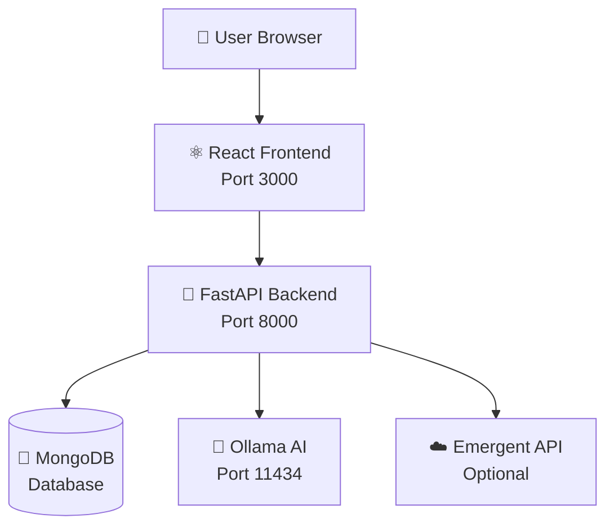
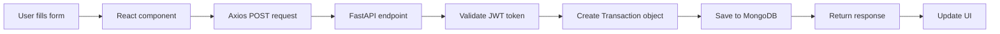
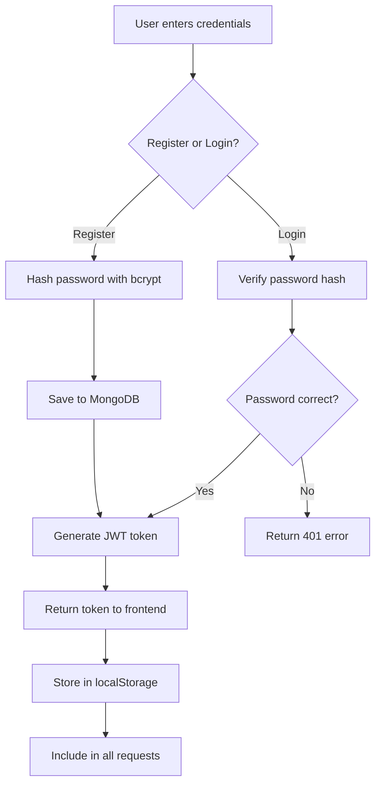
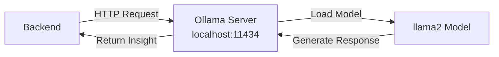
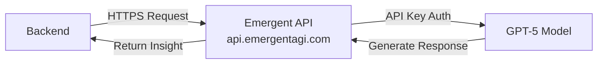
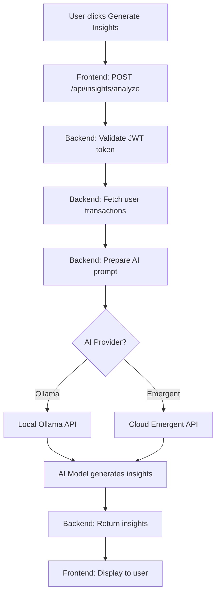
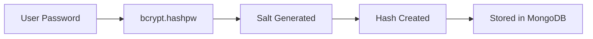
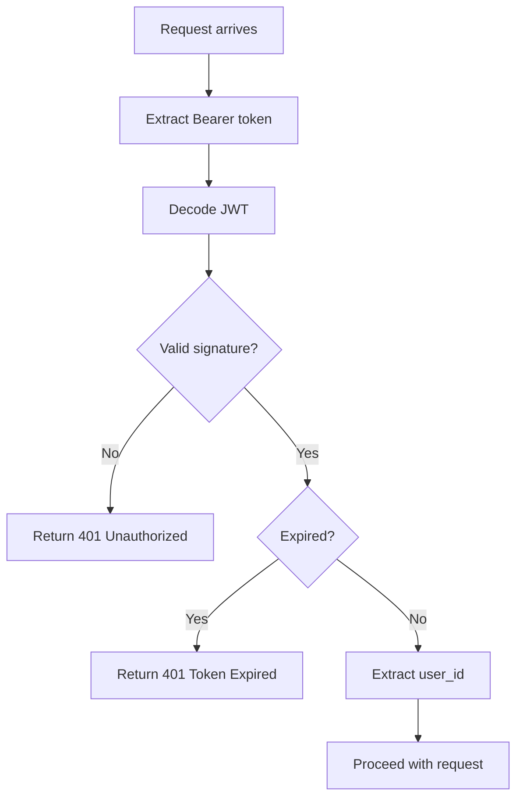
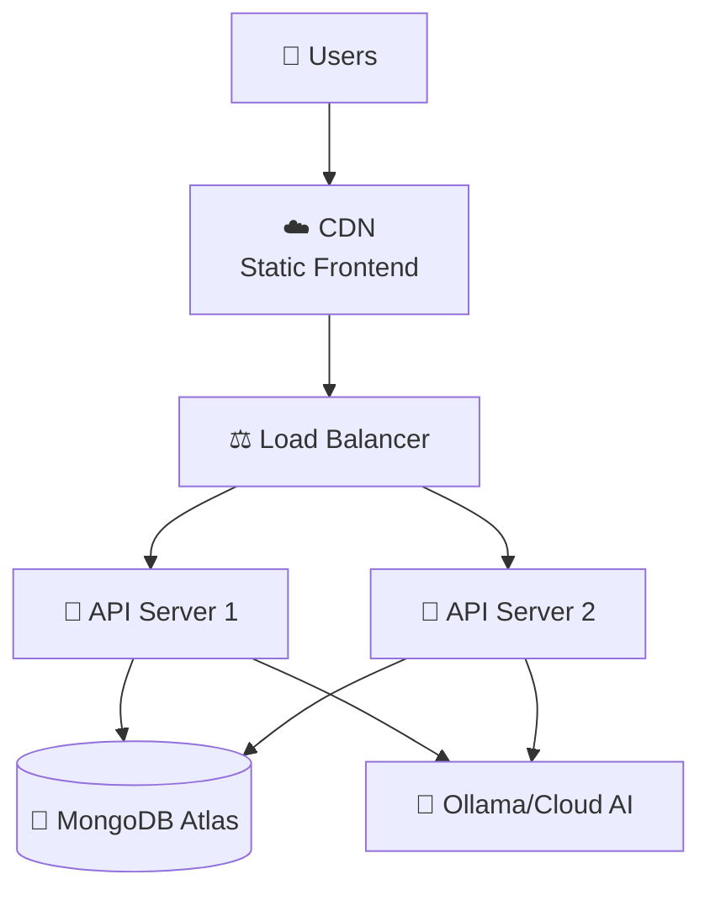

# 🏗️ FINE - System Architecture

## 📊 High-Level Architecture



---

## 🔄 Request Flow

### Example: User Adds a Transaction



---

## 🎯 Component Architecture

### Frontend Structure

```
React App (Port 3000)
│
├── Authentication Flow
│   ├── Register → POST /api/auth/register
│   ├── Login → POST /api/auth/login
│   └── Token stored in localStorage
│
├── Protected Routes (Requires Auth)
│   │
│   ├── Dashboard ("/")
│   │   └── GET /api/dashboard/stats
│   │
│   ├── Transactions ("/transactions")
│   │   ├── GET /api/transactions (list)
│   │   ├── POST /api/transactions (create)
│   │   └── DELETE /api/transactions/{id}
│   │
│   ├── Goals ("/goals")
│   │   ├── GET /api/goals (list)
│   │   ├── POST /api/goals (create)
│   │   ├── PATCH /api/goals/{id} (update)
│   │   └── DELETE /api/goals/{id}
│   │
│   └── Insights ("/insights")
│       ├── POST /api/insights/analyze (AI)
│       └── GET /api/insights/mood-analysis
│
└── UI Components
    └── Radix UI + Tailwind CSS
```

---

## 🗄️ Database Schema

### MongoDB Collections

```javascript
// Collection: users
{
  _id: ObjectId,
  id: "uuid-string",
  email: "user@example.com",
  name: "John Doe",
  password: "$2b$12$hashed...", // bcrypt hash
  created_at: "2025-10-23T10:00:00Z"
}

// Collection: transactions
{
  _id: ObjectId,
  id: "uuid-string",
  user_id: "user-uuid",
  amount: 45.50,
  category: "Food",
  description: "Lunch",
  type: "expense", // or "income"
  mood: "happy", // or "sad", "stressed", "calm", "neutral"
  date: "2025-10-23T12:30:00Z",
  created_at: "2025-10-23T12:30:00Z"
}

// Collection: goals
{
  _id: ObjectId,
  id: "uuid-string",
  user_id: "user-uuid",
  title: "Emergency Fund",
  target_amount: 5000,
  current_amount: 1250,
  deadline: "2025-12-31T00:00:00Z",
  created_at: "2025-10-23T10:00:00Z"
}
```

---

## 🔐 Authentication Flow



### JWT Token Structure

```javascript
// Payload
{
  user_id: "abc123",
  email: "user@example.com",
  exp: 1729785600 // Expires in 24 hours
}

// Signed with JWT_SECRET
// Algorithm: HS256
```

---

## 🤖 AI Integration Architecture

### Ollama (FREE Local AI)



**Configuration:**
```python
openai_client = OpenAI(
    api_key='ollama',
    base_url='http://localhost:11434/v1'
)
```

### Emergent API (PAID Cloud AI)



**Configuration:**
```python
openai_client = OpenAI(
    api_key=os.environ['EMERGENT_LLM_KEY'],
    base_url='https://api.emergentagi.com/v1'
)
```

---

## 📡 API Endpoints

### Authentication
| Method | Endpoint | Description | Auth Required |
|--------|----------|-------------|---------------|
| POST | `/api/auth/register` | Create new user | ❌ |
| POST | `/api/auth/login` | Login user | ❌ |
| GET | `/api/auth/me` | Get current user | ✅ |

### Transactions
| Method | Endpoint | Description | Auth Required |
|--------|----------|-------------|---------------|
| POST | `/api/transactions` | Create transaction | ✅ |
| GET | `/api/transactions` | List all user transactions | ✅ |
| DELETE | `/api/transactions/{id}` | Delete transaction | ✅ |

### Goals
| Method | Endpoint | Description | Auth Required |
|--------|----------|-------------|---------------|
| POST | `/api/goals` | Create goal | ✅ |
| GET | `/api/goals` | List all user goals | ✅ |
| PATCH | `/api/goals/{id}` | Update goal progress | ✅ |
| DELETE | `/api/goals/{id}` | Delete goal | ✅ |

### Insights
| Method | Endpoint | Description | Auth Required |
|--------|----------|-------------|---------------|
| POST | `/api/insights/analyze` | Generate AI insights | ✅ |
| GET | `/api/insights/mood-analysis` | Get mood spending data | ✅ |

### Dashboard
| Method | Endpoint | Description | Auth Required |
|--------|----------|-------------|---------------|
| GET | `/api/dashboard/stats` | Get dashboard statistics | ✅ |

---

## 🔄 Data Flow Example: Generate AI Insights



**Request Payload:**
```json
{
  "context": "Analyze my spending patterns",
  "transactions": [
    {
      "type": "expense",
      "amount": 45,
      "category": "Food",
      "description": "Lunch",
      "mood": "stressed"
    },
    // ... up to 20 recent transactions
  ]
}
```

**AI Prompt (sent to LLM):**
```
You are a financial advisor analyzing spending patterns and emotional well-being.

User's recent transactions:
- expense: $45 on Food - Lunch (Mood: stressed)
- expense: $20 on Transport - Uber (Mood: stressed)
- income: $3000 on Salary - Monthly pay (Mood: happy)
...

Context: Analyze my spending patterns

Provide:
1. Key spending patterns
2. Emotional spending insights
3. 2-3 actionable recommendations

Keep response concise and friendly.
```

**AI Response Example:**
```
Key Spending Patterns:
- Food spending increases 40% during stressed periods
- Transport costs spike on weekdays
- Entertainment spending primarily on weekends

Emotional Spending Insights:
- Stress correlates with impulse food purchases
- Happy mood shows balanced spending
- Calm periods have lowest expenses

Recommendations:
1. Set a weekly food budget of $150
2. Meal prep on Sundays to reduce stress-related eating out
3. Try free stress-relief activities (walking, meditation)
```

---

## 🛡️ Security Architecture

### Password Security


**Example:**
```python
# Registration
password = "mypassword123"
hashed = bcrypt.hashpw(password.encode(), bcrypt.gensalt())
# Stored: $2b$12$randomsaltandhash...

# Login
input_password = "mypassword123"
stored_hash = "$2b$12$randomsaltandhash..."
valid = bcrypt.checkpw(input_password.encode(), stored_hash.encode())
# Returns: True or False
```

### JWT Token Validation


### CORS Protection
```python
# Only allows requests from:
CORS_ORIGINS = "http://localhost:3000,http://127.0.0.1:3000"

# Blocks all other origins
```

---

## 📦 Technology Stack Details

### Backend Stack
```
FastAPI (Web Framework)
├── Starlette (ASGI framework)
├── Pydantic (Data validation)
├── Uvicorn (ASGI server)
│
MongoDB (Database)
├── Motor (Async MongoDB driver)
├── AsyncIOMotorClient (Connection)
│
Authentication
├── PyJWT (Token generation/validation)
├── bcrypt (Password hashing)
│
AI Integration
├── OpenAI SDK (Unified interface)
├── Ollama (Local AI)
└── Emergent API (Cloud AI)
```

### Frontend Stack
```
React 19 (UI Library)
├── React Router v7 (Navigation)
├── React Hook Form (Forms)
├── Zod (Validation)
│
HTTP Client
├── Axios (API requests)
├── Interceptors (Auto-auth)
│
UI Components
├── Radix UI (Headless components)
├── Tailwind CSS (Styling)
├── Lucide React (Icons)
├── Sonner (Notifications)
│
Build Tools
├── CRACO (Config override)
├── Webpack (Bundler)
└── Babel (Transpiler)
```

---

## 🌐 Network Architecture

```
┌─────────────────────────────────────────────┐
│           User's Computer                    │
│                                              │
│  ┌──────────────┐      ┌──────────────┐    │
│  │   Browser    │◄────►│   Frontend   │    │
│  │ localhost:   │      │   React App  │    │
│  │    3000      │      │              │    │
│  └──────────────┘      └──────┬───────┘    │
│                                │            │
│                                │ HTTP       │
│                                ▼            │
│                        ┌──────────────┐    │
│                        │   Backend    │    │
│                        │   FastAPI    │    │
│                        │ localhost:   │    │
│                        │    8000      │    │
│                        └───┬──────┬───┘    │
│                            │      │        │
│                     ┌──────┘      └───┐   │
│                     │                  │   │
│                     ▼                  ▼   │
│             ┌──────────────┐   ┌──────────┐│
│             │   MongoDB    │   │  Ollama  ││
│             │  localhost:  │   │localhost:││
│             │    27017     │   │  11434   ││
│             └──────────────┘   └──────────┘│
└─────────────────────────────────────────────┘
                     │
                     │ HTTPS (Optional)
                     ▼
            ┌──────────────────┐
            │  Emergent API    │
            │  (Cloud Service) │
            └──────────────────┘
```

---

## 🔄 State Management

### Frontend State
```javascript
// App-level state (App.js)
const [isAuthenticated, setIsAuthenticated] = useState(false)
const [user, setUser] = useState(null)

// Component-level state (Dashboard.jsx)
const [stats, setStats] = useState(null)
const [loading, setLoading] = useState(true)

// Persistent state
localStorage.getItem('token') // JWT token
```

### Backend State
```python
# Database connection (shared)
client = AsyncIOMotorClient(mongo_url)
db = client[DB_NAME]

# Request state (per request)
user_id = get_current_user(credentials)

# No session state (stateless API)
```

---

## 🚀 Deployment Architecture (Future)



**Production Recommendations:**
- Frontend: Vercel, Netlify, or AWS S3 + CloudFront
- Backend: AWS EC2, Heroku, or DigitalOcean
- Database: MongoDB Atlas (cloud)
- AI: Keep Ollama local or use cloud API

---

## 📊 Performance Considerations

### Database Indexing
```javascript
// Recommended indexes for MongoDB
db.users.createIndex({ email: 1 }, { unique: true })
db.transactions.createIndex({ user_id: 1, date: -1 })
db.goals.createIndex({ user_id: 1 })
```

### Caching Opportunities
```python
# Future improvements
- Cache dashboard stats (Redis)
- Cache AI responses for common queries
- Implement pagination for transactions
```

### Scalability
```
Current: Single server
Future:
- Horizontal scaling with multiple API instances
- Database sharding by user_id
- CDN for static assets
- Separate AI service
```

---

## 🧪 Testing Architecture

### Backend Tests
```bash
# Unit tests for models
pytest tests/test_models.py

# Integration tests for API
pytest tests/test_api.py

# AI integration tests
pytest tests/test_ai.py
```

### Frontend Tests
```bash
# Component tests
npm test

# E2E tests (future)
npm run cypress
```

---

## 📈 Monitoring & Logging

### Current Logging
```python
# Backend logging
logging.basicConfig(level=logging.INFO)
logger.info("Transaction created")
logger.error(f"AI insight error: {str(e)}")
```

### Future Monitoring
```
- Application Performance Monitoring (APM)
- Error tracking (Sentry)
- Analytics (Google Analytics)
- Database monitoring (MongoDB Compass)
```

---

## 🔧 Configuration Management

### Environment Variables

**Backend (.env):**
```env
MONGO_URL=mongodb://localhost:27017/
DB_NAME=fine_db
JWT_SECRET=secret-key
CORS_ORIGINS=http://localhost:3000
USE_OLLAMA=true
OLLAMA_BASE_URL=http://localhost:11434/v1
OLLAMA_MODEL=llama2
```

**Frontend (.env):**
```env
REACT_APP_BACKEND_URL=http://localhost:8000
```

---

**This architecture supports:**
- ✅ Scalable user growth
- ✅ Flexible AI provider switching
- ✅ Secure authentication
- ✅ Fast response times
- ✅ Easy deployment
- ✅ Future enhancements

