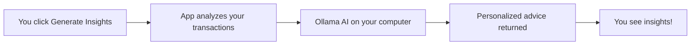

# 🌟 Welcome to FINE - Finance Intelligent Ecosystem

## 👋 Start Here!

This document will guide you through everything you need to know about your personal finance application with AI-powered emotional intelligence.

---

## 📚 Documentation Index

I've created comprehensive documentation for you. Here's where to find everything:

### 🚀 **[QUICK_START.md](QUICK_START.md)** ⭐ START HERE!
**Read this first to get up and running in 5 minutes**
- Installation prerequisites
- Automated setup instructions
- How to run the application
- First-time user guide
- Troubleshooting common issues

### 📖 **[README.md](README.md)**
**Project overview and quick reference**
- Feature highlights
- Technology stack
- Quick start commands
- API documentation
- Configuration guide

### 🛠️ **[SETUP_GUIDE.md](SETUP_GUIDE.md)**
**Detailed installation and configuration**
- Step-by-step setup for all components
- MongoDB installation
- Ollama (FREE AI) setup
- Backend and frontend configuration
- Running the application
- Comprehensive troubleshooting

### 📊 **[FUNCTIONALITY_SUMMARY.md](FUNCTIONALITY_SUMMARY.md)**
**Complete feature walkthrough**
- What each feature does
- How the application works
- Data flow examples
- Use case scenarios
- Security features
- AI configuration options

### 🏗️ **[ARCHITECTURE.md](ARCHITECTURE.md)**
**Technical deep dive**
- System architecture diagrams
- Database schema
- API endpoints
- Authentication flow
- AI integration details
- Performance considerations

---

## ⚡ Quick Start (TL;DR)

### 1. Install Prerequisites
```powershell
# MongoDB - https://www.mongodb.com/try/download/community
# Python 3.8+ - https://www.python.org/downloads/
# Node.js 16+ - https://nodejs.org/
# Ollama (FREE AI) - https://ollama.ai/download
ollama pull llama2
```

### 2. Run Setup
```powershell
setup.bat
```

### 3. Start Application
```powershell
# Terminal 1
start-backend.bat

# Terminal 2
start-frontend.bat
```

### 4. Open Browser
http://localhost:3000

---

## 🎯 What is FINE?

**FINE** is a personal finance tracking application that combines:

✅ **Transaction Tracking** - Log income and expenses with categories
✅ **Emotional Intelligence** - Tag transactions with your mood
✅ **AI-Powered Insights** - Get personalized financial advice
✅ **Goal Setting** - Track progress toward financial targets
✅ **Dashboard Analytics** - Visual overview of your finances

### 🌟 What Makes It Unique?

Unlike traditional finance apps, FINE understands the **emotional side of money**:

- Track your **mood** when spending
- See how **emotions affect** your financial decisions
- Get **AI-powered insights** into your spending patterns
- Receive **personalized recommendations** to improve habits

---

## 🔑 API Key - SOLVED! ✅

### ❌ Problem
The app was configured to use Emergent AGI API which requires a paid API key.

### ✅ Solution
I've updated the application to support **Ollama** - a **100% FREE** local AI!

**Benefits:**
- ✅ No API key needed
- ✅ Completely free forever
- ✅ Runs locally (private)
- ✅ No internet required
- ✅ No usage limits

**Setup:**
```powershell
# 1. Download from https://ollama.ai/download
# 2. Install and run:
ollama pull llama2

# 3. That's it! The app is already configured to use it.
```

**Alternative:** If you prefer cloud AI or can't install Ollama, you can still use the paid Emergent API by getting an API key and updating `backend/.env`.

---

## 📁 Project Files

### Configuration Files (Created for You)
- ✅ **`backend/.env`** - Backend configuration (MongoDB, AI settings)
- ✅ **`frontend/.env`** - Frontend configuration (API URL)
- ✅ **`backend/.env.example`** - Template for backend config
- ✅ **`frontend/.env.example`** - Template for frontend config

### Launcher Scripts (Created for You)
- ✅ **`setup.bat`** - Automated setup (installs everything)
- ✅ **`start-backend.bat`** - Starts the backend server
- ✅ **`start-frontend.bat`** - Starts the frontend app

### Documentation (Created for You)
- ✅ **`START_HERE.md`** - This file (overview)
- ✅ **`QUICK_START.md`** - 5-minute setup guide
- ✅ **`SETUP_GUIDE.md`** - Detailed installation
- ✅ **`FUNCTIONALITY_SUMMARY.md`** - Feature guide
- ✅ **`ARCHITECTURE.md`** - Technical details
- ✅ **`README.md`** - Project overview

---

## 🎨 Application Features

### 1. 🏠 Dashboard
Your financial command center showing:
- Current balance
- Total income and expenses
- Recent transactions
- Top spending categories
- Quick stats

### 2. 💰 Transactions
Add and manage all financial transactions:
- Income or expense
- Categories (Food, Transport, Shopping, etc.)
- Mood tags (Happy, Sad, Stressed, Calm, Neutral)
- Descriptions and dates
- Full history with filtering

### 3. 🎯 Goals
Set and track financial goals:
- Emergency fund
- Vacation savings
- Major purchases
- Custom goals
- Progress tracking

### 4. 🧠 Insights (AI-Powered)
Get intelligent analysis of your finances:
- **AI Financial Analysis**: Personalized advice based on your behavior
- **Mood-Based Spending**: See how emotions affect spending
- **Spending Patterns**: Identify trends and habits
- **Actionable Recommendations**: Specific steps to improve

### 5. 🔐 Authentication
Secure user accounts:
- Registration with email/password
- Encrypted password storage
- JWT token sessions
- Protected routes

---

## 🤖 How AI Works

### With Ollama (FREE - Recommended)



**Privacy:** Your financial data **never leaves your computer**!

### Example AI Insight

**Your Data:**
- 5 food purchases when stressed ($200)
- 2 entertainment purchases when happy ($80)
- 1 savings deposit when calm ($500)

**AI Analysis:**
```
Key Spending Patterns:
You spend significantly more on food when stressed ($200 vs $50 
average). Entertainment spending is healthy and aligned with 
positive emotions.

Emotional Insights:
Stress appears to trigger comfort food purchases. Consider 
healthier stress-relief alternatives.

Recommendations:
1. Set a weekly stress-food budget of $40
2. Try free activities: walking, meditation, or journaling
3. Track stress levels separately to identify triggers
```

---

## 🛠️ Technology Stack

**Backend:**
- Python + FastAPI (fast web framework)
- MongoDB (flexible database)
- JWT + Bcrypt (security)
- Ollama (free AI)

**Frontend:**
- React 19 (modern UI)
- Tailwind CSS (beautiful styling)
- Radix UI (accessible components)
- Axios (API communication)

**AI:**
- Ollama (free local AI)
- Llama2 model (open source)
- Alternative: Emergent API (cloud, paid)

---

## 📊 System Requirements

**Minimum:**
- Windows 10/11
- 8GB RAM
- 10GB free disk space
- Internet connection (for setup only)

**Recommended:**
- Windows 11
- 16GB RAM
- SSD storage
- Internet connection

---

## 🚀 Getting Started Checklist

Follow this exact order:

- [ ] Read **[QUICK_START.md](QUICK_START.md)**
- [ ] Install MongoDB
- [ ] Install Python 3.8+
- [ ] Install Node.js 16+
- [ ] Install Ollama (for FREE AI)
- [ ] Download llama2 model: `ollama pull llama2`
- [ ] Run `setup.bat`
- [ ] Start backend: `start-backend.bat`
- [ ] Start frontend: `start-frontend.bat`
- [ ] Open http://localhost:3000
- [ ] Create account
- [ ] Add a transaction
- [ ] Generate AI insights!

**Estimated time:** 15-30 minutes (most time is downloading dependencies)

---

## 🎓 Learning Path

### Day 1: Setup & Basics
1. Complete installation
2. Create account
3. Add 3-5 transactions with moods
4. Explore the dashboard

### Day 2: Goals & Tracking
1. Set 2 financial goals
2. Add more transactions throughout the day
3. Track spending by category
4. Update goal progress

### Week 1: AI Insights
1. After collecting transaction data
2. Generate your first AI insights
3. Review mood-based spending
4. Implement one recommendation

### Ongoing: Habit Building
1. Log every transaction immediately
2. Always tag with your mood
3. Review insights weekly
4. Adjust behavior based on AI advice
5. Track progress toward goals

---

## 💡 Pro Tips

### For Best AI Insights
1. **Add transactions consistently** - More data = better insights
2. **Always tag mood** - This is the secret sauce!
3. **Be honest about categories** - Accurate categorization helps
4. **Use descriptions** - Helps AI understand context
5. **Generate insights weekly** - Let patterns emerge

### For Financial Success
1. **Set realistic goals** - Start small, build momentum
2. **Review dashboard daily** - Awareness is key
3. **Identify emotional triggers** - Understand your patterns
4. **Act on recommendations** - AI advice only works if you use it
5. **Track progress** - Celebrate small wins

---

## 🔧 Troubleshooting

### Common Issues

**MongoDB won't start:**
```powershell
net start MongoDB
```

**Ollama not working:**
```powershell
ollama serve
ollama list  # Should show llama2
```

**Backend errors:**
```powershell
cd backend
venv\Scripts\activate
pip install -r requirements.txt
```

**Frontend errors:**
```powershell
cd frontend
npm install
```

**For detailed troubleshooting, see [SETUP_GUIDE.md](SETUP_GUIDE.md)**

---

## 📞 Getting Help

### Documentation
1. Check **[QUICK_START.md](QUICK_START.md)** for setup issues
2. See **[SETUP_GUIDE.md](SETUP_GUIDE.md)** for detailed instructions
3. Review **[FUNCTIONALITY_SUMMARY.md](FUNCTIONALITY_SUMMARY.md)** for feature questions

### API Documentation
- Start backend server
- Visit: http://localhost:8000/docs
- Test endpoints interactively

### Logs
- **Backend logs**: Check terminal running `start-backend.bat`
- **Frontend logs**: Check browser console (F12)
- **MongoDB logs**: Check MongoDB Compass

---

## 🎯 Next Steps

1. **Right now:** Read **[QUICK_START.md](QUICK_START.md)** and set up the app
2. **Today:** Add your first transactions and explore features
3. **This week:** Generate your first AI insights
4. **This month:** Review patterns and improve financial habits
5. **Ongoing:** Use FINE daily to build better money habits

---

## 🌟 What You'll Achieve

With FINE, you'll:

✅ **Understand your spending** - See exactly where money goes
✅ **Recognize emotional patterns** - Know how mood affects decisions
✅ **Make better choices** - Act on AI-powered recommendations
✅ **Reach financial goals** - Track and achieve savings targets
✅ **Build healthy habits** - Develop positive money behaviors

---

## 📈 Success Metrics

After using FINE for one month, you should be able to:

- [ ] Identify your top 3 spending categories
- [ ] Recognize which emotions trigger overspending
- [ ] Implement at least 2 AI recommendations
- [ ] Reduce impulse purchases by 20%
- [ ] Make progress on at least 1 financial goal
- [ ] Feel more confident about your finances

---

## 🎉 Ready to Start?

### Your Journey Begins Here:

**Step 1:** Open **[QUICK_START.md](QUICK_START.md)**

**Step 2:** Follow the setup instructions

**Step 3:** Start tracking your finances with emotional intelligence!

---

## 📄 File Structure Overview

```
fine-jain-main/
│
├── 📘 Documentation
│   ├── START_HERE.md ⭐ (You are here)
│   ├── QUICK_START.md (Setup guide)
│   ├── SETUP_GUIDE.md (Detailed setup)
│   ├── FUNCTIONALITY_SUMMARY.md (Features)
│   ├── ARCHITECTURE.md (Technical)
│   └── README.md (Overview)
│
├── 🚀 Launcher Scripts
│   ├── setup.bat (One-time setup)
│   ├── start-backend.bat (Run backend)
│   └── start-frontend.bat (Run frontend)
│
├── ⚙️ Backend
│   ├── server.py (API code)
│   ├── requirements.txt (Dependencies)
│   ├── .env (Configuration) ✅ Created
│   └── .env.example (Template)
│
└── 🎨 Frontend
    ├── src/ (React app)
    ├── package.json (Dependencies)
    ├── .env (Configuration) ✅ Created
    └── .env.example (Template)
```

---

## ✅ Summary

**What you have:**
- ✅ Full-featured finance tracking app
- ✅ AI-powered insights with FREE Ollama
- ✅ Emotional intelligence features
- ✅ All configuration files ready
- ✅ Automated setup scripts
- ✅ Comprehensive documentation

**What you need to do:**
1. Install prerequisites (MongoDB, Python, Node.js, Ollama)
2. Run `setup.bat`
3. Start the servers
4. Begin tracking your finances!

---

**🌟 Everything is ready. Your financial transformation starts now! 🚀**

**Next → [QUICK_START.md](QUICK_START.md)**
